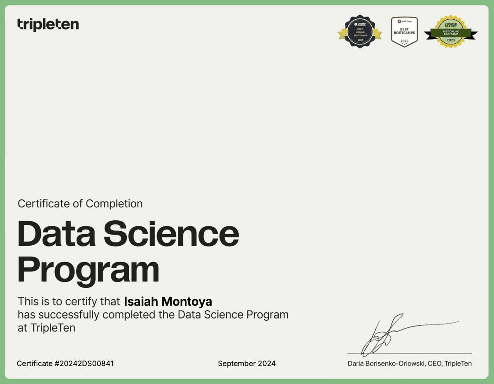

# Isaiah Montoya

## Welcome to My GitHub! 👋

Hello! I'm Isaiah, a Data Scientist with a diverse background and broad set of domain knowledge. I have 3+ years experience working in business intelligence, blended with a Summa Cum Laude degree in English Creative Writing from Arizona State University, enabling me to effectively communicate technical solutions to people of tech and non-tech backgrounds.  

My skills and passion for data analysis and software development grew out of necessity from working in the field. Inundated with spreadsheets, I began writing increasingly complex formulas to solve simple business problems. From there I was hooked. I taught myself the Visual Basic programming language and deployed complex macros that solved real-world business problems at StrataTech education group. By March of 2023, I was committed to a career in data and transitioning to IT. I enrolled in MIT's Introduction to Computer Science and Programming course where I gained a solid foundation in the principles of programming and the Python programming language. I quickly applied these skills in my professional life, deploying an algorithm to correctly classify the status of over 10,000 records during a data migration process, amongst many other successes.

Most recently, I have completed the data science Certification from TripleTen tech. With over 700 hours of training, I became an expert in Python, software engineering, machine learning, and neural networks. During my time in this program I completed [16 data science projects.](https://github.com/IMMontoya/Data_projects_TripleTen/blob/main/README.md)

### What I Bring to the Table 🛠️

- **A Love for Learning**: I am adept at learning new trades and skills quickly. I have successfully jumped into areas outside of data science proper, i.e. software engineering, business strategy development, marketing, and even some mechanical and electrical engineering. I am infinitely curious and love to nerd-out about things, so gaining domain knowledge is a natural and enjoyable process for me.
- **Programming Languages**: Proficient in Python 🐍, with a knack for bringing data to life through code.
- **Data Analysis Tools**: Skilled in SQL, Excel (including VBA), Power BI, Pandas, and Tableau for comprehensive data analysis and visualization 📈.
- **Database Management**: Experienced in managing, cleaning, and preprocessing data to keep information accurate and accessible 📚.
- **AI and Machine Learning**: I have experience creating models for [binary classification](https://github.com/IMMontoya/interconnect_predict_churn/blob/main/README.MD), [predictive regression](https://github.com/IMMontoya/predicting_used_car_market_values_with_machine_learning/blob/main/README.md), [time series forecasting](https://github.com/IMMontoya/forecasting_hourly_taxi_orders_using_machine_learning/blob/main/README.MD0), [natural language processing (NLP)](https://github.com/IMMontoya/sentiment_analysis_with_natural_language_processing/blob/main/README.MD), and [computer vision](https://github.com/IMMontoya/predicting_age_with_computer_vision/blob/main/README.MD). I am also well versed in large language model (LLM) prompting.  

### My Academic Background 🎓

- **Data Science Certification - TripleTen Tech:**
In this 680+ hour [program](https://tripleten.com/data-science/), I was able to gain years of education and hands on experience in an accelerated time frame. The coursework was challenging and comprehensive, covering topics such as advanced Python programming, exploratory data analysis, statistical data analysis, software development tools, SQL, machine learning, supervised learning, ML in business, linear algebra, numerical methods, time series analysis, ML for texts, computer vision, and unsupervised learning. This program also provided soft skills training in effective communication, task management, accepting and providing feedback, remote work, independence and cooperation, solving conflicts, and presenting ideas.  

    

    
    

- **Introduction to Computer Science and Programming Using Python Certification - MITx**: Received an A grade from this excellent Masechussets Institute of Technology course offered through EDX. This course provided an outstanding foundation in the principals of computer science and computation thinking. I cannot suggest this course enough, so I will link it [here.](https://learning.edx.org/course/course-v1:MITx+6.00.1x+1T2023/home)  

    

    
    

- **Summa Cum Laude Bachelor of Arts in English Creative Writing - Arizona State University**: My journey through literature has given me a unique perspective on storytelling, critical thinking, and effective communication. These skills give me a competitive edge when it comes to translating technical solutions and insights to non-technical audiences.

    

    
    

You can view all of my certifications in the [certifications directory](/certifications/)

### Professional Experience 💼

Previously, I worked as a **Data Specialist** at StrataTech Education Group, where I honed my expertise in ad hoc reporting, data analysis, and ETL procedures to uncover key insights that informed strategic decisions. In this role, I showcased my ability to manage complex datasets, utilize analytical tools effectively, and collaborate across departments to drive data-driven improvements in marketing strategies and operational processes.

Before StrataTech, I served in the Finance Department at Art Solutions as an **Accounts Manager**, where I utilized QuickBooks and developed a Google Sheets tool to enhance financial data management and streamline operations. My work involved analyzing financial transactions, reconciling accounts, and applying my analytical skills to develop a customized solution that significantly improved the accuracy and efficiency of prorated storage costs calculations.

These experiences have equipped me with a solid foundation in data manipulation, analysis, and visualization, preparing me for a successful career in data science and analytics.

### Broad-Based Expertise and Interests 🌈

My professional toolkit extends beyond data science, encompassing a wide array of additional skills and passions that enhance my analytical capabilities and contribute to a holistic approach to problem-solving:

- **Music and Audio**: As a trained musician and recording engineer, I possess a nuanced understanding of sound, complementing data projects that involve audio analysis or require innovative auditory data abstractions 🎵.
- **Creativity and Artistry**: My endeavors as a musical artist, alongside my experience in poetry and fiction writing, enrich my ability to craft engaging narratives and visualize data in ways that resonate on a human level 🖌️.
- **Microcontroller Programming**: My self-taught expertise in microcontroller programming allows me to tackle projects involving automation and robotics with a hands-on, practical approach to creating solutions 🤖.
- **Politics, Economics, and Finance**: My interest in these areas fuels my ability to dissect complex datasets, ensuring my analyses are informed by a deep understanding of the broader socio-economic and political contexts 🌍.

This blend of technical proficiency and diverse interests not only amplifies my data science skill set but also makes me a versatile team member capable of crossing traditional boundaries to drive innovation. My broad knowledge base enables me to contribute uniquely to projects, particularly those at the intersection of technology and critical global issues, positioning me as a valuable asset to teams looking for dynamic and insightful expertise.

### Currently Seeking New Opportunities 🚀

I am actively searching for new roles that allow me to leverage my data science and analysis skills to make a meaningful impact. My interests are broad yet I am deeply focused on the details. Specifically, I'm passionate about contributing to projects related to **politics, climate, sustainability, robotics, and automation**.

What sets me apart is not just my technical expertise in data science but also my wide breadth of knowledge across various domains. This interdisciplinary understanding enables me to approach problems from unique perspectives, fostering innovative solutions that are both effective and sustainable. I believe that my diverse background not only enhances my ability to analyze and interpret data but also makes me a valuable asset to teams working at the cutting edge of their fields.

If you're looking for a dynamic and insightful data scientist with a commitment to driving positive change through data-driven decisions, I'd love to explore how I can contribute to your team.

### Connect With Me 📫

- **LinkedIn**: [Connect on LinkedIn](https://www.linkedin.com/in/isaiah-montoya-317309106/)
- **Email**: [immontoya93@gmail.com](mailto:immontoya93@gmail.com)

Feel free to explore my repositories for a glimpse into my work and the projects that I am passionate about. Let's connect and explore how data can drive decisions, shape strategies, and create value!

<!--
**IMMontoya/IMMontoya** is a ✨ _special_ ✨ repository because its `README.md` (this file) appears on your GitHub profile.
